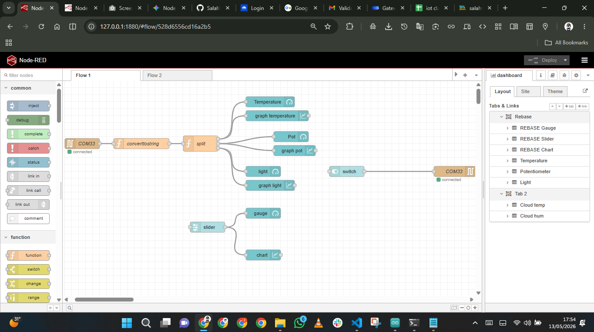
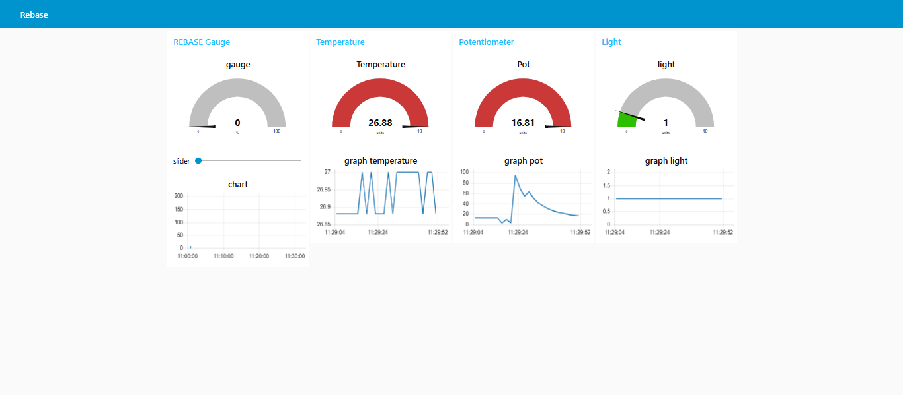
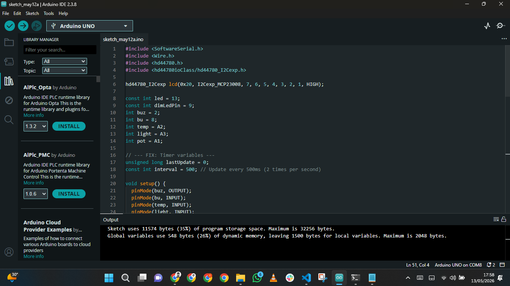

# Arduino-Sensor-Tests

A lightweight Arduino-based embedded system designed to monitor and display environmental data. This project integrates multiple analog sensors with an I2C LCD interface to provide real-time feedback on temperature, light levels, and manual potentiometer input.

## Preview




## Features
* **Real-time Data Visualization:** Displays Temperature (Celsius), Light Intensity (%), and Potentiometer position (%) on a 16x2 LCD.
* **Serialized Data Stream:** Outputs formatted sensor readings to the Serial Monitor at 9600 baud, ideal for data logging or external processing.
* **I2C Integration:** Uses the `hd44780` library for efficient communication with an I2C-expanded LCD (MCP23008).
* **Custom Scaling:** Includes calibrated formulas to convert raw analog signals into meaningful units.

## Hardware Requirements
* **Microcontroller:** Arduino (Uno, Nano, or compatible)
* **Display:** 16x2 LCD with I2C Expander (MCP23008)
* **Sensors & Components:**
    * **Temperature Sensor:** Connected to A2
    * **Light Sensor (LDR):** Connected to A3
    * **Potentiometer:** Connected to A1
    * **Buzzer:** Connected to Digital Pin 2
    * **Push Button:** Connected to Digital Pin 8
    * **LED:** Onboard or external Pin 13

## Prerequisites
You will need the following libraries installed in your Arduino IDE:
* `hd44780` by Bill Perry (Available via the Library Manager)
* `Wire.h` (Standard library)

## Installation & Usage
1. **Clone the repository:**
   ```bash
   git clone [https://github.com/SalahVincent/Arduino-Sensor-Tests.git](https://github.com/SalahVincent/Arduino-Sensor-Tests.git)
   
```markdown
# Arduino-Sensor-Tests

A lightweight Arduino-based embedded system designed to monitor and display environmental data. This project integrates multiple analog sensors with an I2C LCD interface to provide real-time feedback on temperature, light levels, and manual potentiometer input.

## Features
* **Real-time Data Visualization:** Displays Temperature (Celsius), Light Intensity (%), and Potentiometer position (%) on a 16x2 LCD.
* **Serialized Data Stream:** Outputs formatted sensor readings to the Serial Monitor at 9600 baud, ideal for data logging or external processing.
* **I2C Integration:** Uses the `hd44780` library for efficient communication with an I2C-expanded LCD (MCP23008).
* **Custom Scaling:** Includes calibrated formulas to convert raw analog signals into meaningful units.

## Hardware Requirements
* **Microcontroller:** Arduino (Uno, Nano, or compatible)
* **Display:** 16x2 LCD with I2C Expander (MCP23008)
* **Sensors & Components:**
    * **Temperature Sensor:** Connected to A2
    * **Light Sensor (LDR):** Connected to A3
    * **Potentiometer:** Connected to A1
    * **Buzzer:** Connected to Digital Pin 2
    * **Push Button:** Connected to Digital Pin 8
    * **LED:** Onboard or external Pin 13

## Prerequisites
You will need the following libraries installed in your Arduino IDE:
* `hd44780` by Bill Perry (Available via the Library Manager)
* `Wire.h` (Standard library)

## Installation & Usage
1. **Clone the repository:**
   ```bash
   git clone [https://github.com/SalahVincent/Arduino-Sensor-Tests.git](https://github.com/SalahVincent/Arduino-Sensor-Tests.git)